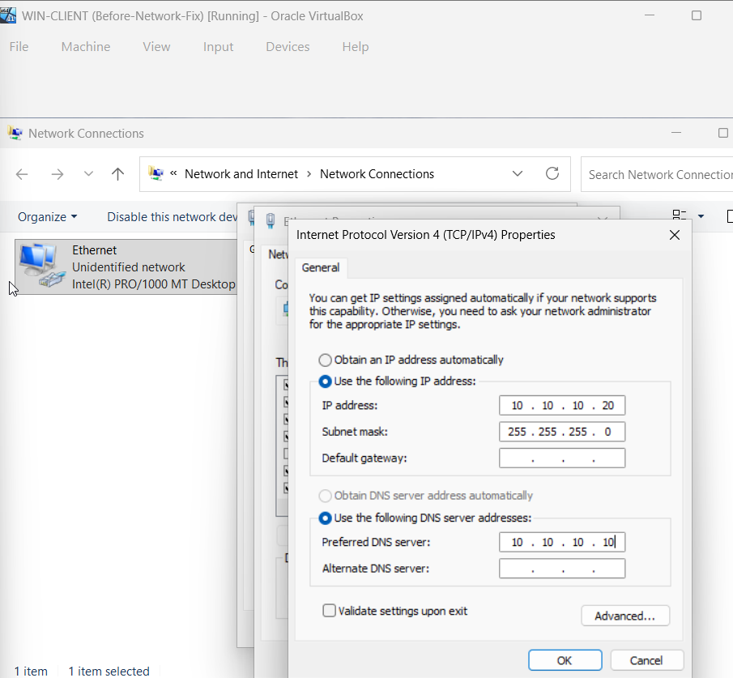
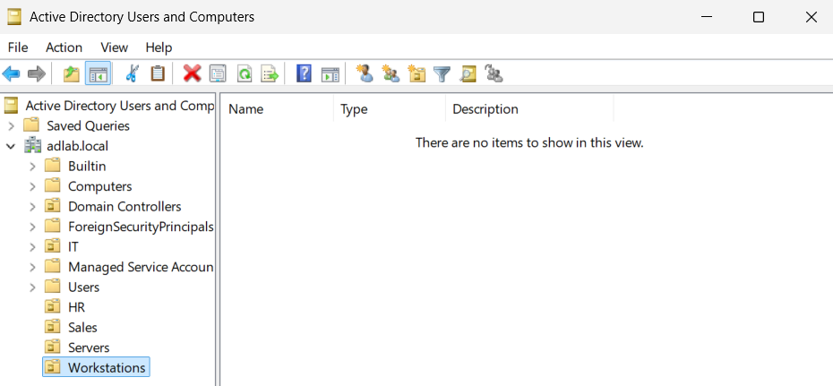
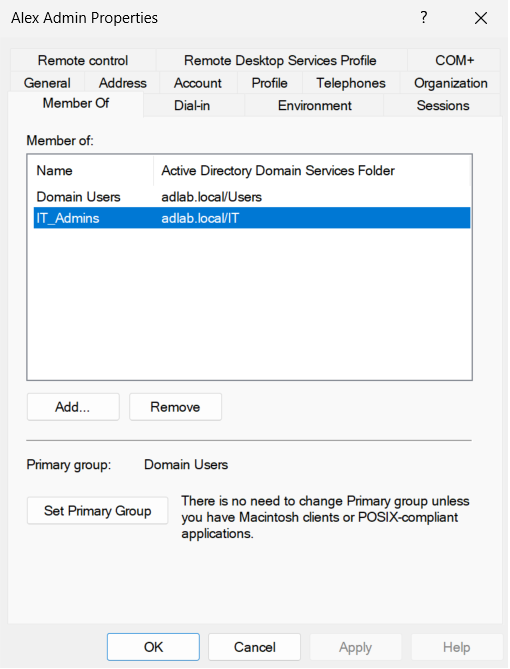
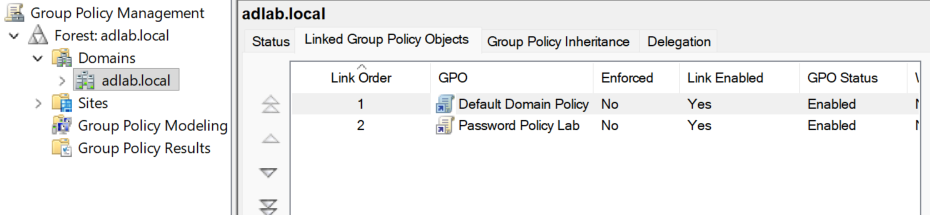
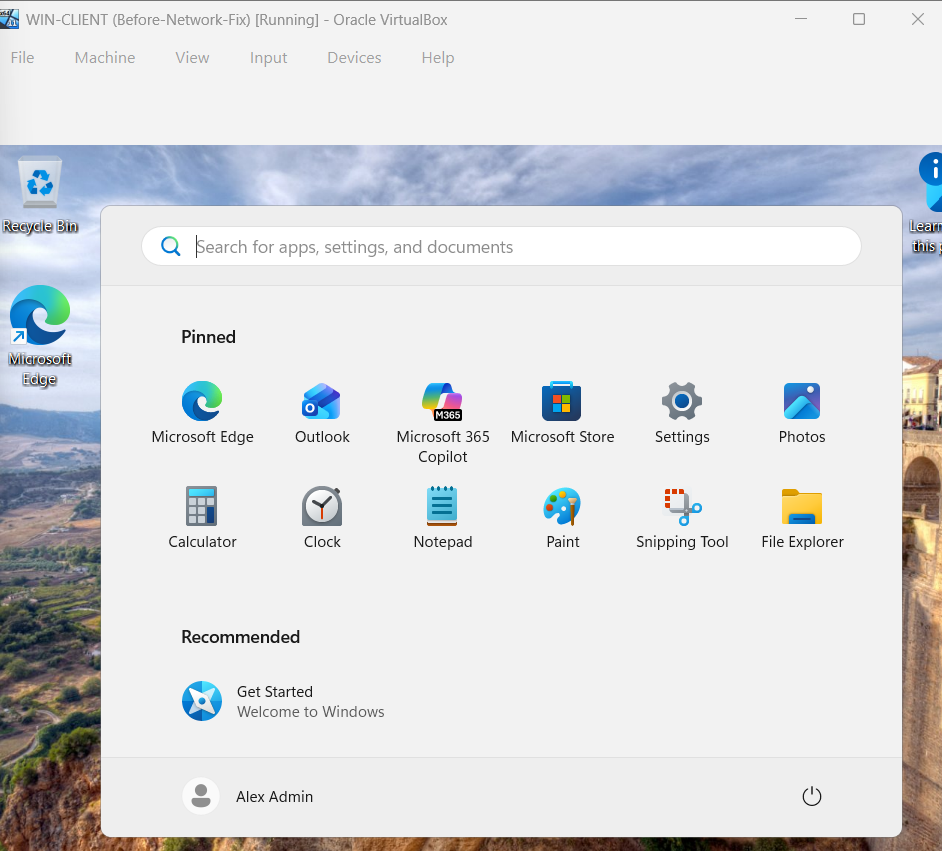
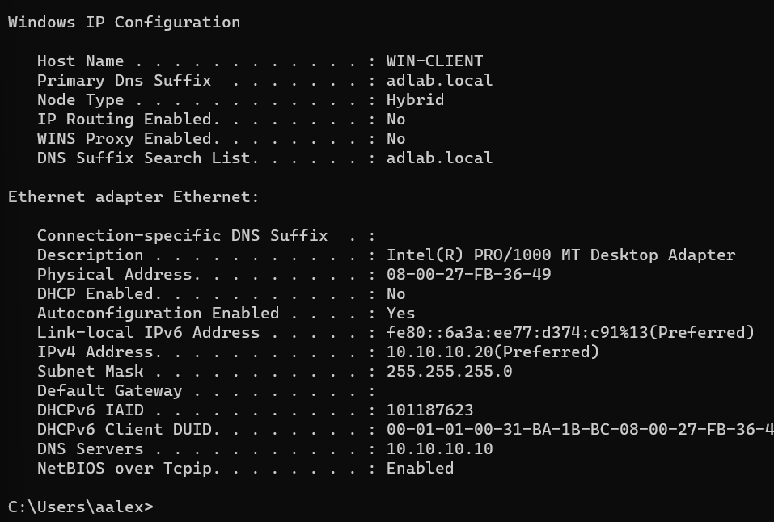

# Active Directory Fundamentals Lab

## Overview

This project demonstrates the deployment and administration of a Windows Active Directory environment using VirtualBox. The lab includes the installation and configuration of Windows Server 2025, Active Directory Domain Services (AD DS), DNS, Group Policy, user and group administration, and the deployment of a domain-joined Windows 11 client workstation.

## Technologies Used

- Windows Server 2025 Standard Evaluation (Desktop Experience)
- Windows 11 Pro
- Active Directory Domain Services (AD DS)
- DNS
- Group Policy Management
- VirtualBox
- Windows Networking

## Environment Configuration

### Network Configuration 

- DC1: 10.10.10.10
- WIN-CLIENT: 10.10.10.20
- DNS Server: 10.10.10.10
 
### Domain Controller (DC1)

- Windows Server 2025
- Active Directory Domain Services
- DNS Server
- Domain: adlab.local
- Static IP: 10.10.10.10

### Client Workstation

- Windows 11
- Domain JoinedActive Directory Fundamentals Lab
- Static IP: 10.10.10.20
- DNS Server: 10.10.10.10

## Active Directory Deployment

- Installed Windows Server 2025
- Installed AD DS role
- Promoted server to Domain Controller
- Created the adlab.local domain

## Organizational Structure

### Created Organizational Units (OUs):

- IT
- HR
- Sales
- Servers
- Workstations

 
## User Administration

### Created user accounts:

- IT User: Alex Admin UPN: aalex@adlab.local
- HR User: Sarah Smith UPN: ssmith@adlab.local
- Sales User: John Davis UPN: jdavis@adlab.local

### Configured:

- User passwords
- Account management (disable/enable accounts)
- Password resets
- Group membership

## Group Management

### Created security groups:

- IT_Admins
- HR_Users
- Sales_Users

Assigned users to appropriate security groups.

 
## Group Policy

- Created and linked a Group Policy Object (GPO)
- Explored password policy settings
- Verified Group Policy Management functionality

 
## Client Deployment
- Installed Windows 11 virtual machine
- Configured networking
- Joined Windows 11 workstation to the adlab.local Active Directory domain using administrator credentials.
- Successfully authenticated using domain user credentials (image below)

## Troubleshooting Highlights

### EFI Boot Issue 

- Virtual machine failed to boot.
- Resolved by enabling EFI in VirtualBox settings.

### Display Controller Issue

- Windows installation displayed a black screen.
- Resolved by changing the graphics controller from VBoxSVGA to VMSVGA.

### Server Core Installation

- Initially installed Windows Server Core instead of Desktop Experience.
- Reinstalled using Windows Server 2025 Standard Evaluation (Desktop Experience).

### DNS and Domain Join Troubleshooting

- Client workstation could not resolve adlab.local.
- Verified DNS configuration, DNS service status, and Active Directory health.
- Reconfigured VirtualBox networking and implemented static IP addressing.
- Successfully restored domain name resolution and completed domain join.

## Skills Demonstrated

- Active Directory Administration
- DNS Configuration
- User and Group Management
- Group Policy Management
- Windows Server Administration
- Virtualization
- Network Troubleshooting
- Domain Deployment
- Windows Client Management

## Lessons Learned

- Active Directory relies heavily on proper DNS configuration
- Domain joins can fail even when basic network connectivity is functional
- Windows Server Core and Desktop Experience provide significantly different administration experiences.
- Virtual machine display settings can prevent successful operating system installation.

## Screenshots

Additional screenshots documenting VM setup, troubleshooting, and Active Directory Configuration are available in the [Screenshots Directory](Screenshots/).

## Future Enhancements

- DHCP Deployment
- File Shares and NTFS Permissions
- Advanced Group Policy Configuration
- Help Desk Ticket Simulation
- Multi-Client Domain Environment

