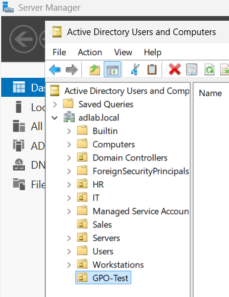
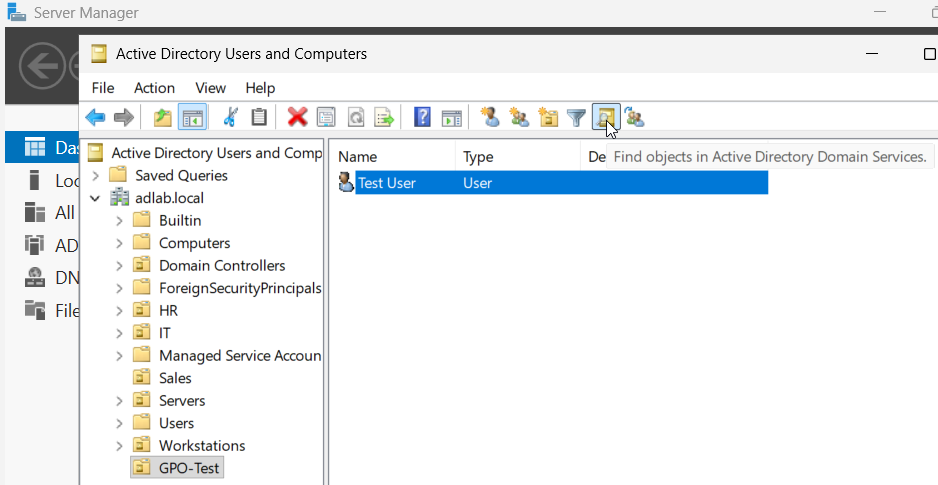
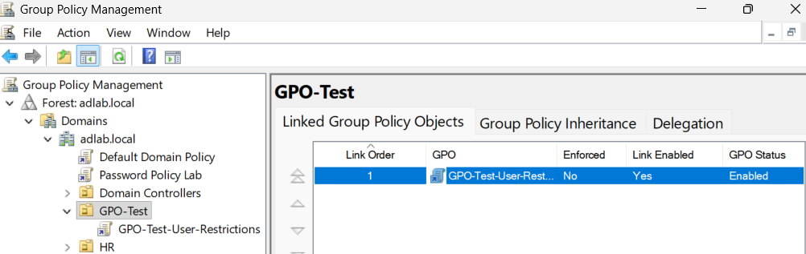
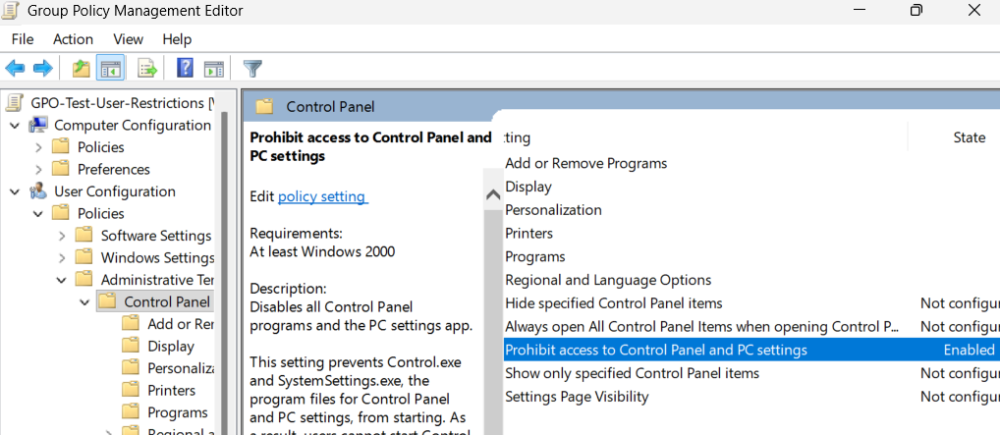
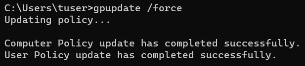
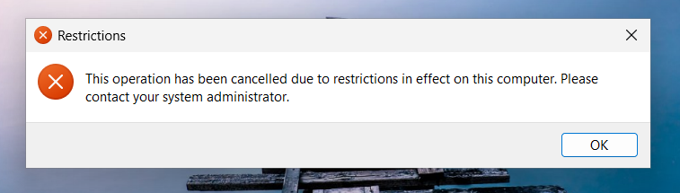
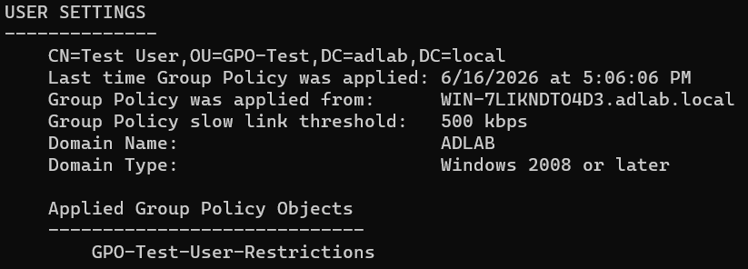

# Group Policy Management Lab - README

## Overview

This lab demonstrates the creation, deployment, and verification of a Group Policy Object (GPO) within an Active Directory environment. A dedicated Organizational Unit (OU) was created to target a specific user account, and a policy was applied to restrict access to Control Panel and Windows Settings.

## Objectives

* Create and manage Organizational Units (OUs)
* Create and link Group Policy Objects (GPOs)
* Configure user-based administrative policies
* Apply policies to targeted users
* Verify policy deployment using Group Policy tools
* Validate policy enforcement on a client workstation

## Technologies Used

* Windows Server 2025
* Active Directory Domain Services (AD DS)
* Group Policy Management Console (GPMC)
* Windows 11 Client
* Command Prompt
* Group Policy Administrative Templates

## Environment

| Component         | Details                    |
| ----------------- | -------------------------- |
| Domain            | adlab.local                |
| Domain Controller | WIN-7LIKNDT04D3            |
| Client Machine    | WIN-CLIENT                 |
| Test OU           | GPO-Test                   |
| Test User         | Test User                  |
| GPO               | GPO-Test-User-Restrictions |

## Tasks Performed

**1. Created a dedicated Organizational Unit (OU)**

**2. Moved a test user into the OU**

**3. Created and linked a Group Policy Object**

**4. Enabled a user restriction policy**

**5. Forced a Group Policy update**

**6. Tested policy enforcement**

**7. Verified policy application using gpresult**

## Results

The policy successfully prevented the test user from accessing Control Panel and Windows Settings. Verification was completed using **gpupdate** and **gpresult**, confirming successful Group Policy deployment and enforcement.

