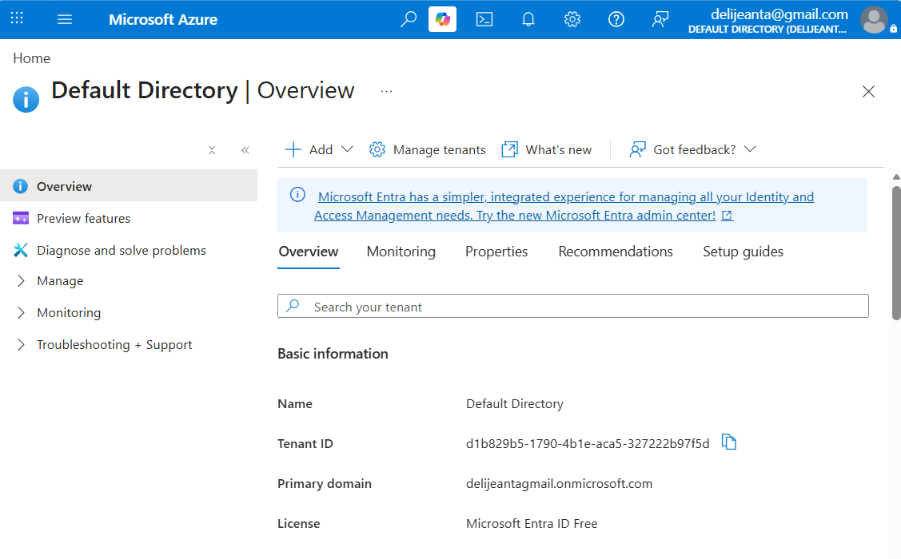
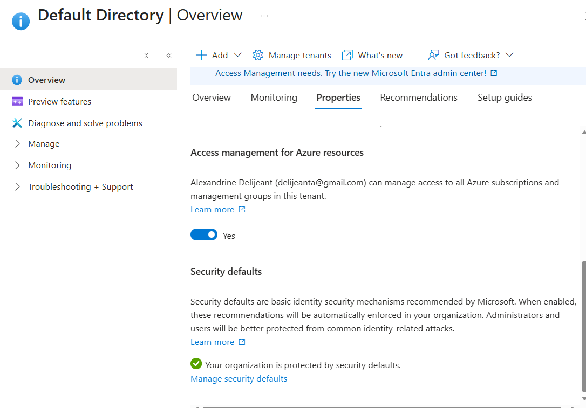
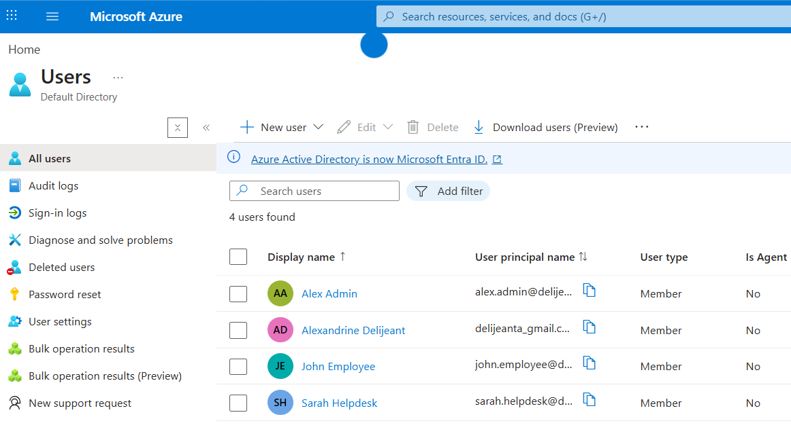
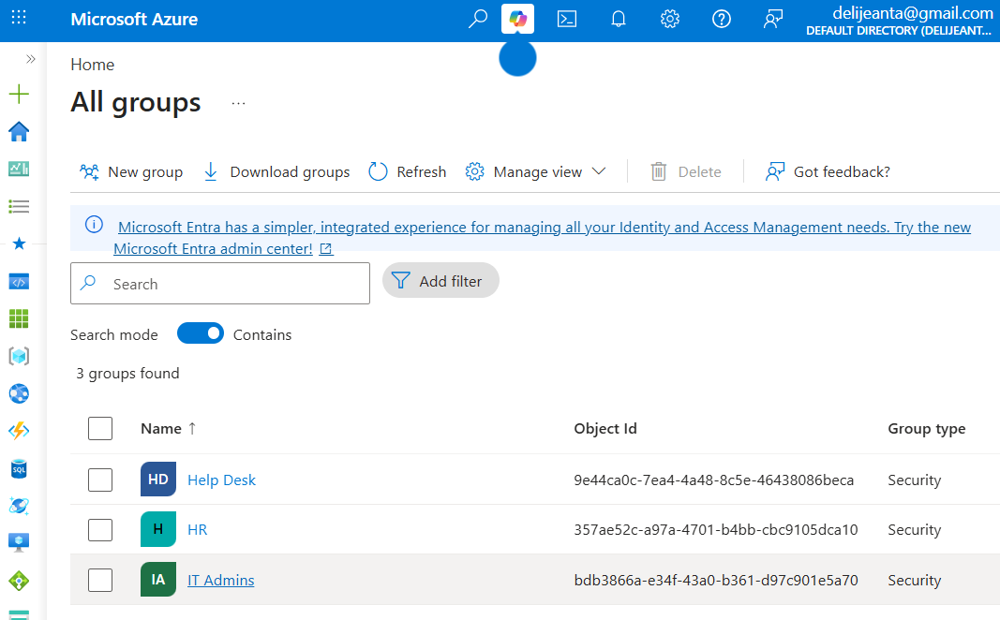
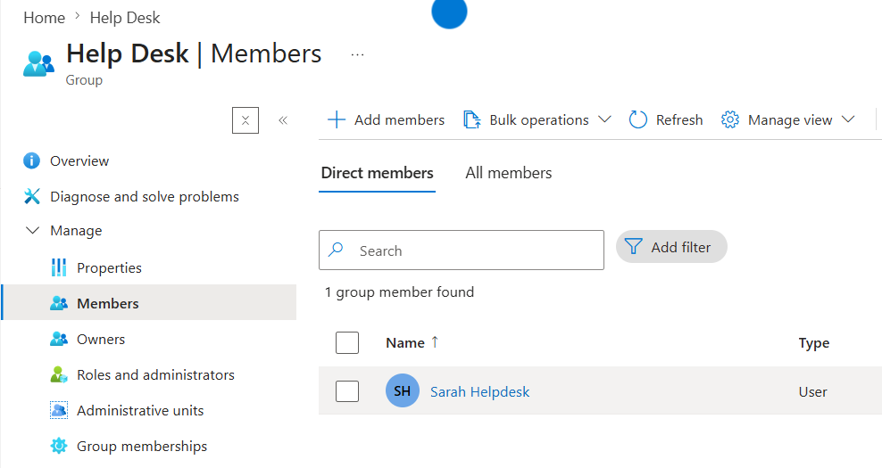
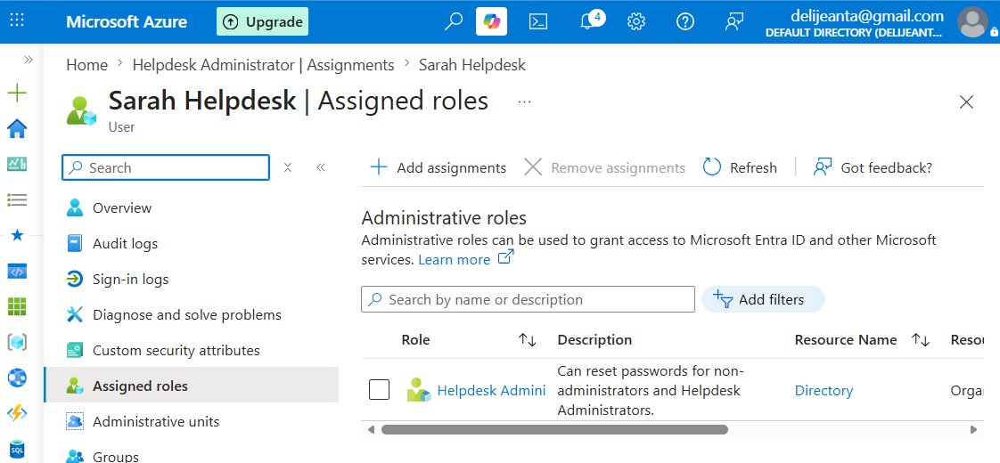
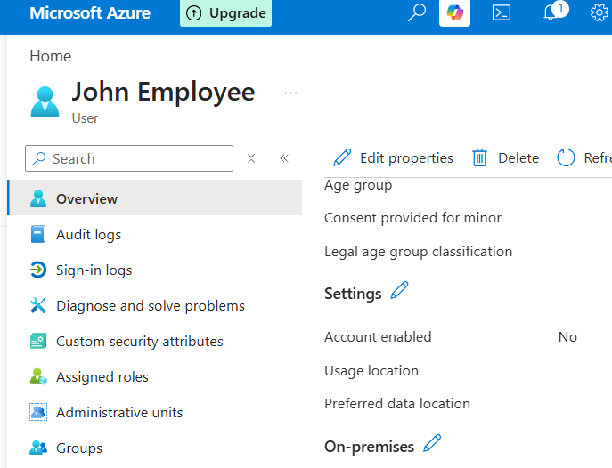
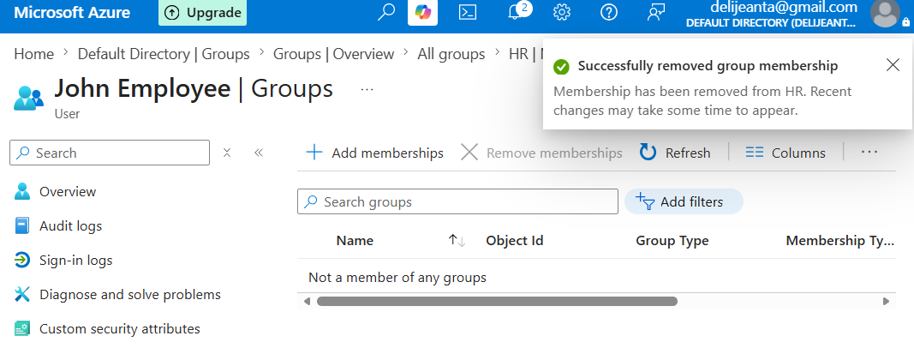

# Microsoft Entra ID Administration Lab - README.md

## Overview

This lab demonstrates core Microsoft Entra ID (formerly Azure Active Directory) administration tasks commonly performed by Help Desk and System Administrators. The project focuses on user lifecycle management, group-based access control, role assignment, authentication management, and employee offboarding procedures.

## Objectives

* Create and manage cloud user accounts
* Create security groups
* Assign users to groups
* Assign administrative roles
* Explore authentication methods and MFA options
* Simulate employee offboarding procedures

## Technologies Used

* Microsoft Azure
* Microsoft Entra ID
* Microsoft Entra Admin Center

## Skills Demonstrated

### Identity Management

* User account creation
* User account administration
* Account disablement

### Access Management

* Security group creation
* Group membership management
* Role-Based Access Control (RBAC)

### Security Administration

* Administrative role assignment
* Authentication method management
* Security Defaults review

### Offboarding Procedures

* Account disablement
* Group membership removal
* Access revocation

## Screenshots

### Environment Setup

* **Entra ID Overview**

* **Security Defaults Configuration** - MFA is a default configuration for users.

### User Administration

* **Users Created**

### Group Administration

* **Security Groups Created**

* **Group Membership Assignment** - Added Sarah Helpdesk to the `Help Desk Group`

### Administrative Roles

* **Helpdesk Administrator Role Assignment** - Assigned to Sarah Helpdesk.

### Offboarding

* **Account Disablement** - Disabled `John Employee` account.

* **Group Membership Removal** - Removed `John Employee` from the HR group.

## Authentication Methods Explored

Explored Authentication Methods and Security Defaults within Microsoft Entra ID. Reviewed available MFA registration options including Email, Phone Number, QR Code (Microsoft Authenticator), and Temporary Access Pass.

## Lab Outcomes

Successfully performed:

- User onboarding
- Security group management
- Role assignment
- Authentication method review
- User offboarding
- Access revocation

## Key Takeaways

This lab provided hands-on experience with Microsoft Entra ID administration and demonstrated the complete identity lifecycle from user onboarding through offboarding. These tasks closely mirror common responsibilities performed by Help Desk and Junior System Administrators in Microsoft cloud environments.
