# Help Desk Ticketing Simulation Lab - README.md

## Project Overview

This project simulates common Tier 1 Help Desk support scenarios using the Spiceworks Cloud Help Desk platform. The objective was to practice ticket creation, incident documentation, troubleshooting workflows, resolution tracking, and ticket lifecycle management.

## Skills Demonstrated

- Ticket Creation and Management
- Incident Documentation
- Troubleshooting Methodology
- User Account Administration
- VPN Connectivity Troubleshooting
- Microsoft 365 Support
- Print Services Troubleshooting
- Multi-Factor Authentication (MFA) Support
- Ticket Resolution and Closure

## Tickets Simulated

### 1. Password Reset Request
- Verified user identity
- Reset Active Directory password
- Required password change at next login
- Confirmed successful authentication

### 2. VPN Connection Failure
- Verified internet connectivity
- Reviewed VPN configuration
- Validated credentials
- Restored VPN access

### 3. Outlook Authentication Failure
- Verified Microsoft 365 service availability
- Reviewed Outlook configuration
- Cleared cached credentials
- Restored mailbox synchronization

### 4. Printer Not Printing
- Reviewed print queue
- Cleared stalled print jobs
- Restarted Print Spooler service
- Verified successful printing

### 5. MFA Enrollment Failure
- Verified Microsoft 365 account status
- Reviewed authentication policies
- Reconfigured MFA registration
- Confirmed successful enrollment

## Screenshots

### Password Reset Request

#### **Ticket Creation**

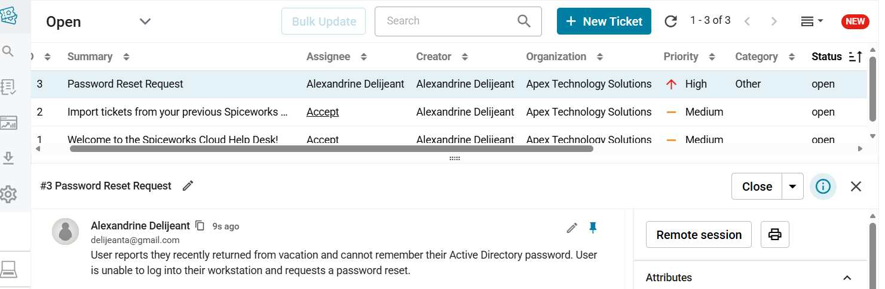

#### **Ticket Workflow**

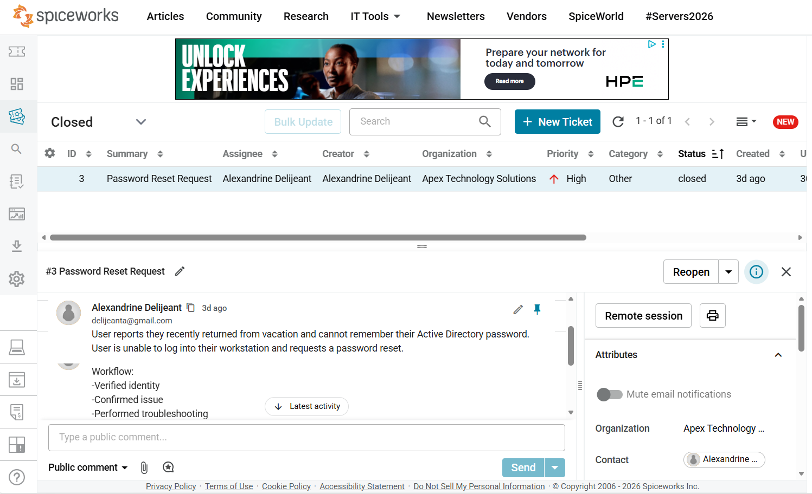

#### **Ticket Resolution**

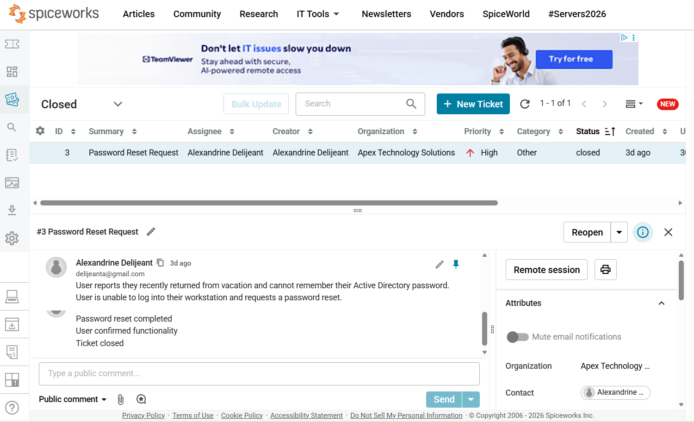

---

### VPN Connection Failure

#### **Ticket Creation**

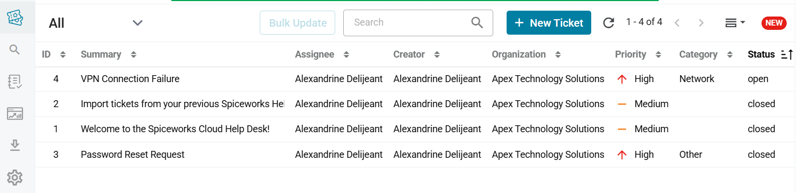

#### **Ticket Workflow**

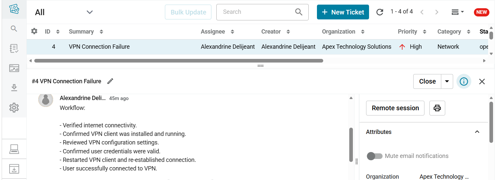

#### **Ticket Resolution**

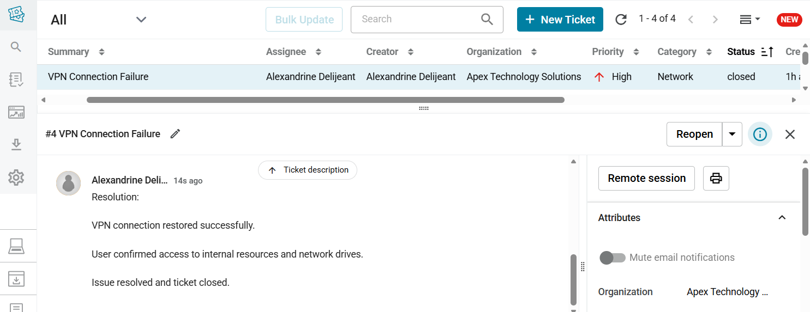

---

### Outlook Authentication Failure

#### **Ticket Creation**

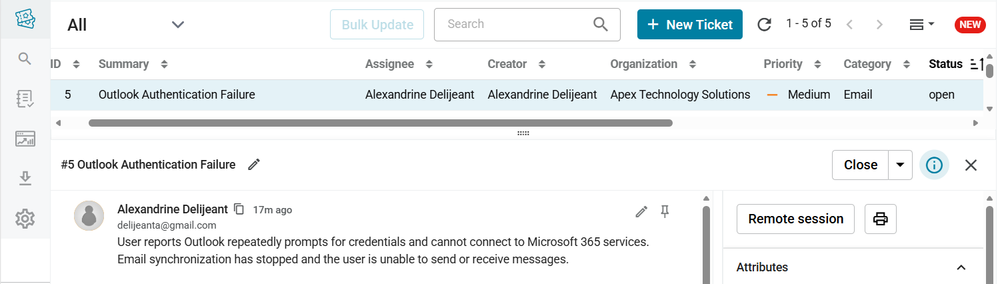

#### **Ticket Workflow**

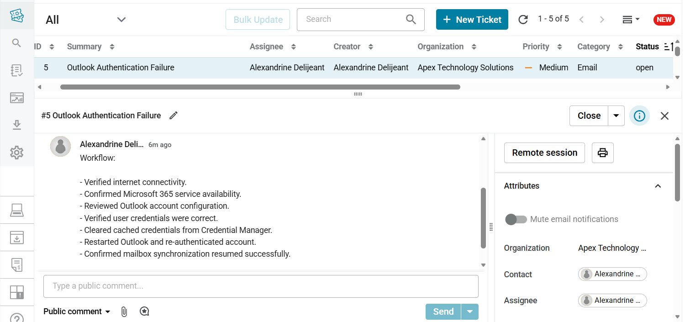

#### **Ticket Resolution**

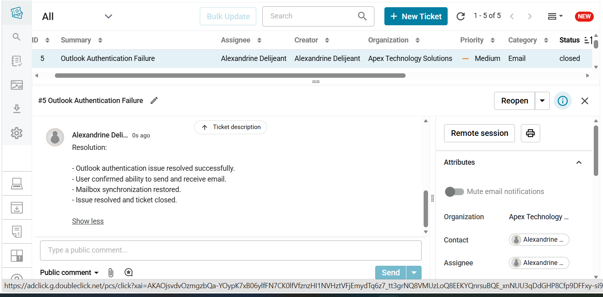

---

### Printer Not Printing

#### **Ticket Creation**

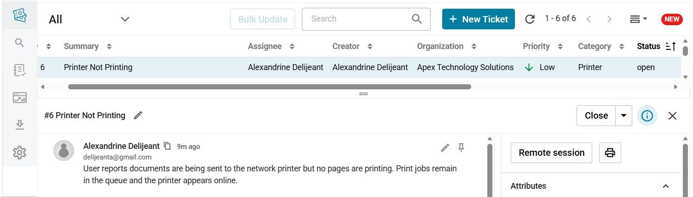

#### **Ticket Workflow**

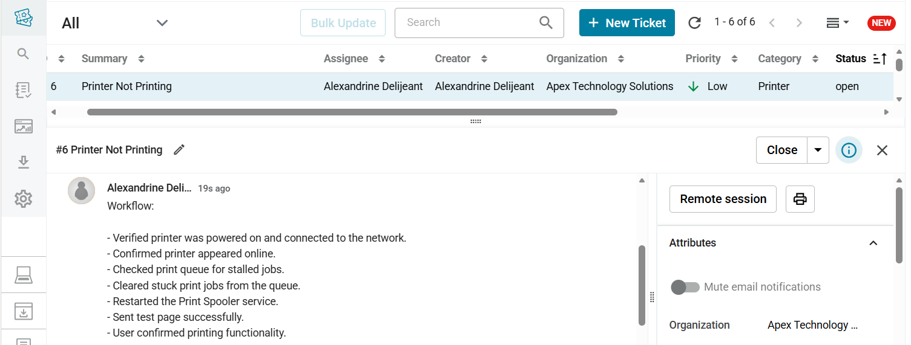

#### **Ticket Resolution**

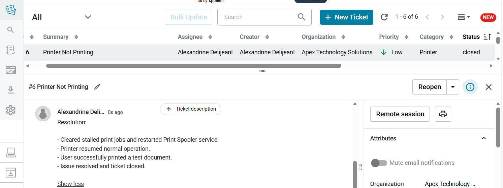

---

### MFA Enrollment Failure

#### **Ticket Creation** 

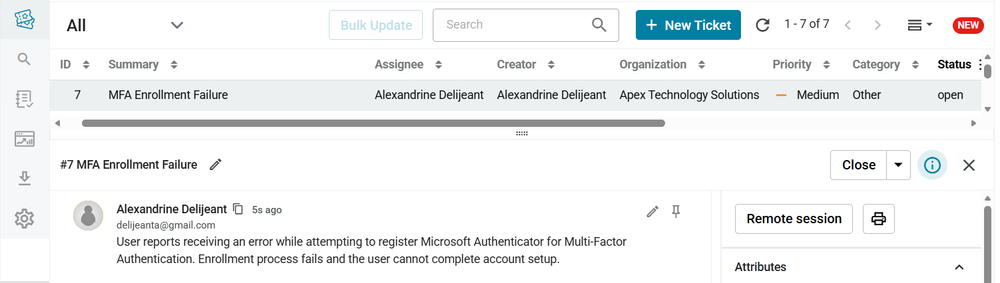

#### **Ticket Workflow**

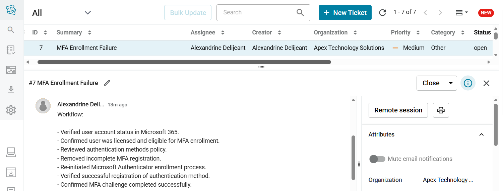

#### **Ticket Resolution**

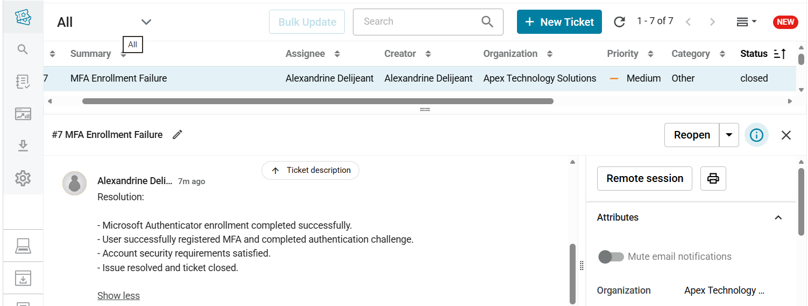

## Key Takeaways

This lab provided hands-on experience with help desk ticket management, incident response workflows, troubleshooting documentation, and common Tier 1 support scenarios frequently encountered in enterprise environments.

